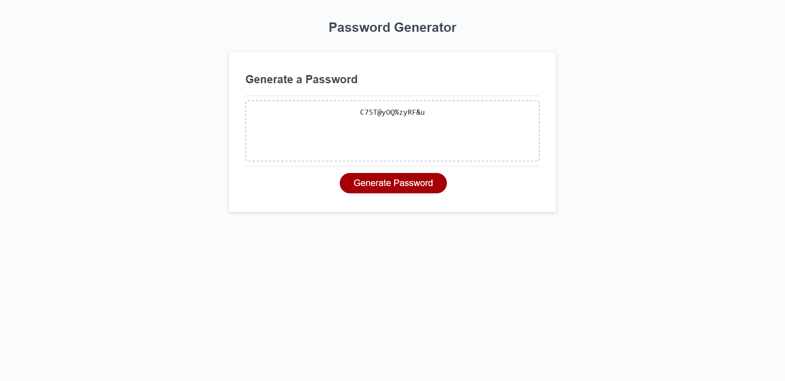

# superGoodPasswordGen

## Description

Provide a short description explaining the what, why, and how of your project. Use the following questions as a guide:

- What was your motivation? 
- I wanted to create a simple applications that prompts the user for input, takes the choices the user made and generate a password based on those choices when the button on the webpage is clicked.
- Why did you build this project? (Note: the answer is not "Because it was a homework assignment.") 
- I wanted an easy to use password generator that generated a password based on my choices.
- What problem does it solve? 
- This solves the issue of trying to create your own strong passwords so you don't use the same password you've been using since middle-school.
- What did you learn? 
- Even smaller, simple projects have their own issues and unforeseen problems that you need to work through

## Table of Contents

- [Installation](#installation)
- [Usage](#usage)
- [Credits](#credits)

## Installation

- To install download the attached files and open in VS code, or preferred coding application.

## Usage

- To use the generator simply go to the deployed webpage, or download the code and open it in your default browser. 
- Press the generate button.
- Answer the prompts as they show up. (in the case of the confirm prompts the 'ok' option is yes and 'cancel' is no.)
- The webpage will then generate a password for you based on you choices!

## Credits

- Credit to the [mdn web docs](https://developer.mozilla.org/en-US/docs/Web/JavaScript/Reference/Operators/Addition_assignment) for information on addition assignment.

---

### Created by Michael Taraschi with ❤